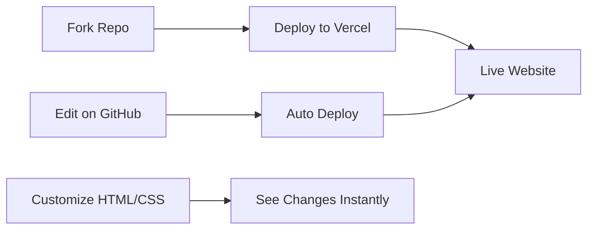

<div align="center">

# 🎨 Creative Agency Portfolio Template

*A stunning, production-ready portfolio template for agencies and creatives*

[](https://vercel.com/new/clone?repository-url=https://github.com/MrShadowRIFAT/QRKLRMF-Agency_Portfolio_Template)


**Built for agencies. Designed for impact. Ready to deploy.**

</div>

---

## ✨ Why This Project

Showcase your creative work with **zero configuration**. Professional multi-page portfolio that converts visitors into clients. Deploy live in seconds.

---

## 🔥 Features

🎯 **Responsive** – Perfect on mobile, tablet, desktop  
⚡ **Fast** – Optimized assets, instant load times  
🎨 **Beautiful** – 3 homepage variants included  
🔄 **Interactive** – Smooth animations & transitions  
📸 **Gallery Ready** – Lightbox & carousel built-in  
🌍 **SEO Optimized** – Meta tags & semantic HTML  
✏️ **Easy Edit** – Modify directly on GitHub  

---

## 🚀 Quick Setup

### 1️⃣ Fork Repository
```bash
# Click Fork button on GitHub
# Your own copy is ready
```

### 2️⃣ Deploy with Vercel
Press the button above → Connect GitHub → Deploy (instant!)

### 3️⃣ Local Development
```bash
git clone https://github.com/YOUR_USERNAME/QRKLRMF-Agency_Portfolio_Template.git
cd QRKLRMF-Agency_Portfolio_Template
python -m http.server 8000
# Open http://localhost:8000
```

---

## 📁 Pages & Sections

| Page | Purpose |
|------|---------|
| `index.html` | Homepage (3 variants) |
| `about-us.html`, `about-me.html` | About sections |
| `services-details.html` | Services showcase |
| `team.html`, `team-details.html` | Team profiles |
| `blog.html`, `blog-details.html` | Blog & articles |
| `project-details.html` | Portfolio pieces |
| `contact.html` | Contact form |

---

## 🧠 How It Works



---

## 🛠️ Tech Stack

<div align="center">


</div>

**HTML5** • **CSS3** • **JavaScript** • **Bootstrap 5** • **Swiper** • **Font Awesome**

---

## 📝 Customization

1. **Edit Content** – Update `.html` files with your info
2. **Replace Images** – Swap `assets/img/` with your portfolio photos
3. **Modify Colors** – Edit `assets/css/style.css`
4. **Update Meta Tags** – Change title, description, og:image
5. **Add Custom Fonts** – Upload to `assets/fonts/`

---

## 📦 Deployment

| Platform | Time | Cost |
|----------|------|------|
| **Vercel** | < 1 min | Free |
| **GitHub Pages** | 2 mins | Free |
| **Netlify** | 2 mins | Free |
| **Traditional Host** | 5 mins | Paid |

---

## 📊 GitHub Stats

<div align="center">


</div>

---

## 👨‍💼 Author

**Rifat** | [🔗 rifat.website](https://rifat.website) | [📧 noreply@rifat.website](mailto:noreply@rifat.website)

---

<div align="center">

**[⭐ Star This Repo](#)** • **[🐛 Report Issue](#)** • **[💡 Suggest Feature](#)**

Made with ❤️ for creative professionals

</div>